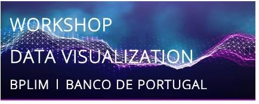
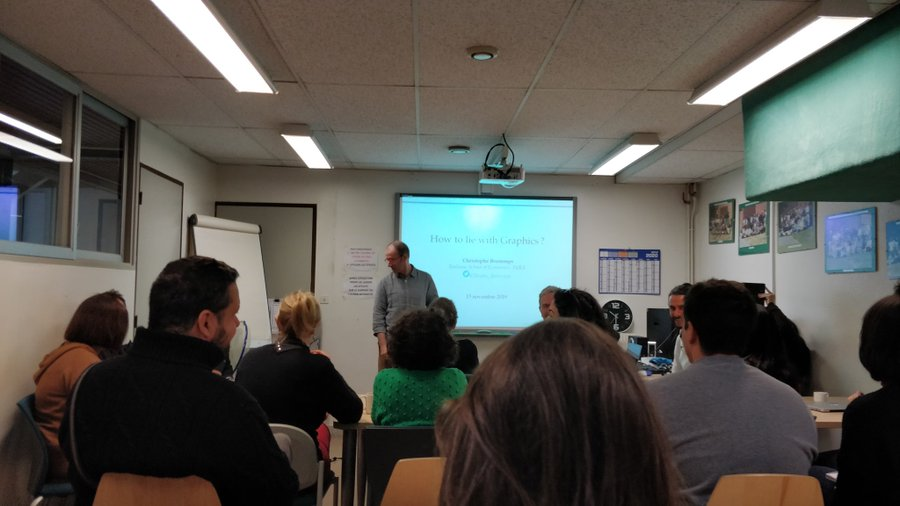
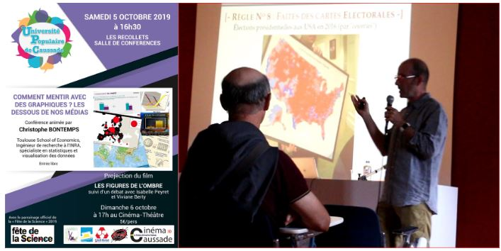
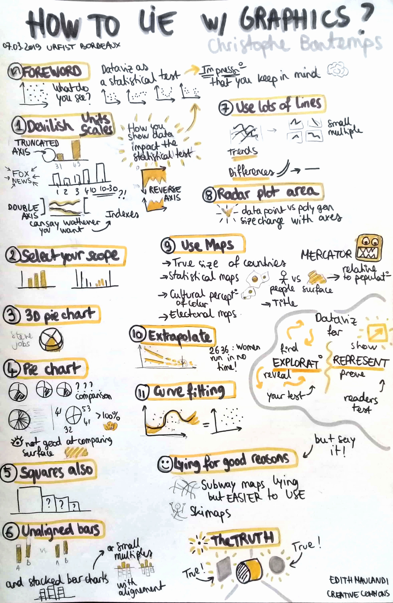
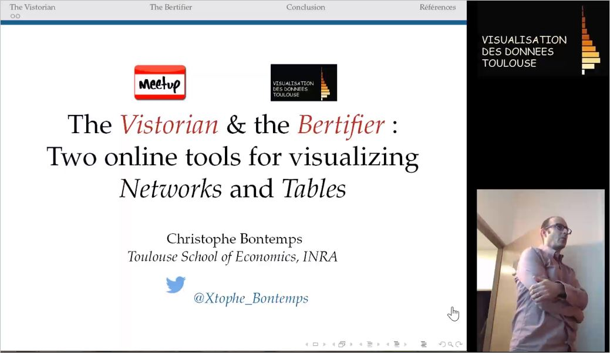
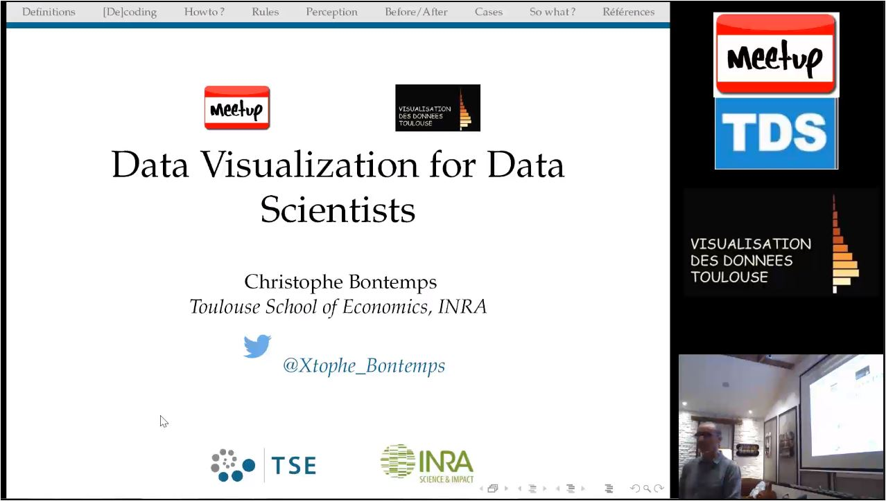
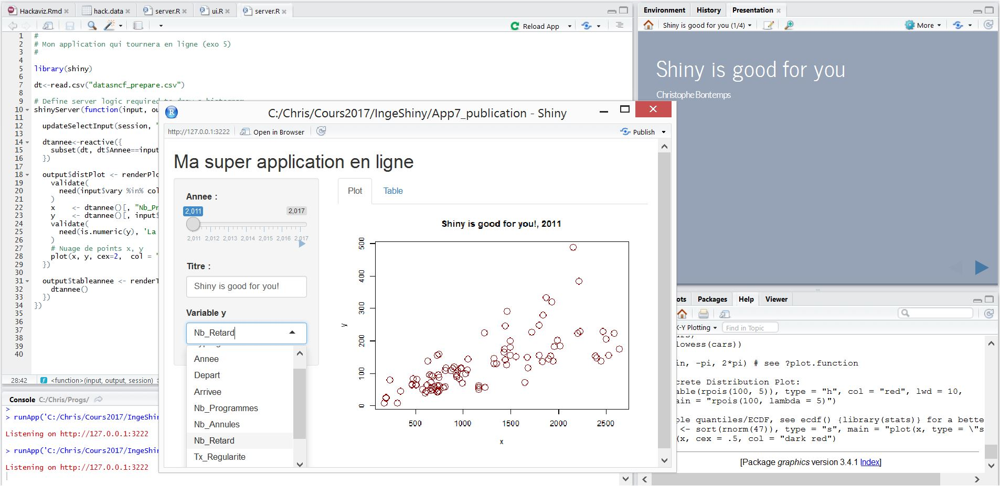
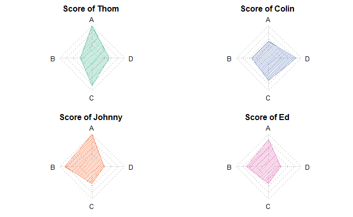
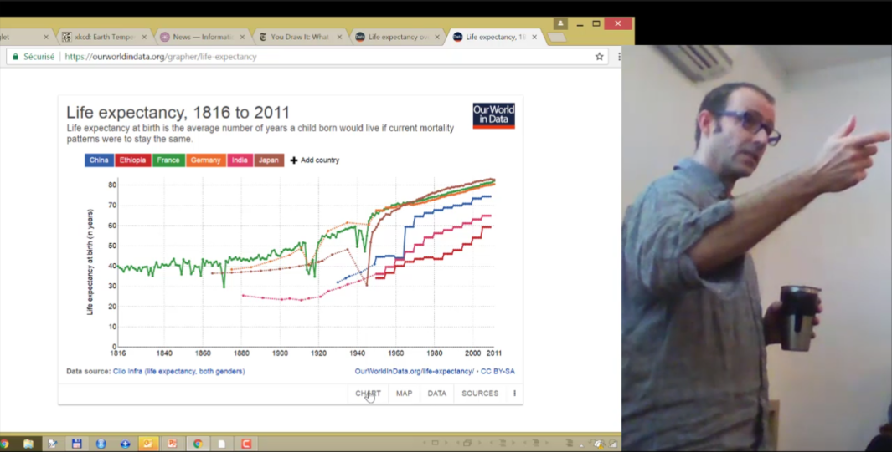

::: {.cards}

::: {.card}

### Data Visualization Workshop -Porto 
*December 2020*

Scientific program curator.

**Speakers**: Alberto Cairo, Christophe Bontemps, Yan Holtz, Chiara Sotis, Christophe Hurter  

[Program](http://data.visualisation.free.fr/Papers/WS_BPLIM2020_DataViz_Program_Site.pdf)  
[Keynote slides](http://data.visualisation.free.fr/Papers/BancoDePortugal2020.pdf)  
[Videos](https://youtu.be/IDs4InpQ0Zw?list=PLUZo4TFBklMYZhiVPzuV_Oxaqay2WbQIM)
:::

::: {.card}

### How to Lie with Graphics  
*2019–2020*

Seminars (MIAT, ENS Lyon, INRAE).

[MIAT slides](http://data.visualisation.free.fr/Blog/HowToLie-Short.pdf)  
[ENS slides](http://data.visualisation.free.fr/Blog/HowToLie-Short-ENS.pdf)
:::

::: {.card}

### Comment mentir avec des graphiques  
*2019*

Fête de la Science & Meetup.

[Slides](http://data.visualisation.free.fr/Blog/Mentir6.pdf)  
[Video](https://vimeo.com/381895600)
:::

::: {.card}

### How to Lie with Graphics  
*March 2019*

Invited talk (Bordeaux).

[Slides](https://framadrive.org/s/nWZsk8XMx5XNfxX#pdfviewer)  
[Video](http://data.visualisation.free.fr/Videos/HowToLieFinal/HowToLieFinal.html)
:::

::: {.card}

### Vistorian & Bertifier  
*January 2019*

Visualization tools (AVIZ, INRIA).

[Slides](https://speakerdeck.com/alaino/the-vistorian-and-the-bertifier)  
[Video](https://vimeo.com/310955855)
:::

::: {.card}

### Data Visualization for Data Scientists  
*2018*

Concepts + practice for data science.

[Slides](https://speakerdeck.com/toulousedatascience/number-26-la-data-visualisation-pour-la-data-science-et-les-data-scientists)  
[Video](http://data.visualisation.free.fr/Videos/DataViz4DataScience/MeetupTDS/MeetupTDS.html)
:::

::: {.card}

### Shiny is Good for You  
*2017*

Intro to interactive apps in R.

[Slides](http://data.visualisation.free.fr/Blog/MeetupShiny.pdf)
:::

::: {.card}

### Why You Should Never Use Radar Plots  
*2017*

On distortion in visual encoding.

[Blog](http://data.visualisation.free.fr/Blog/Why-you-should-never-use-radar-plots.nb.html)
:::

::: {.card}

### Maps & Networks  
*2017*

Visualization principles for spatial/network data.

[Slides](https://fr.slideshare.net/ChristopheBontemps/meetup-maps-networks-why-and-how-to-visualize)  
[Video](http://data.visualisation.free.fr/Videos/MapsAndNetworks/MapsAndNetworks.html)
:::

:::